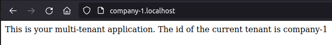
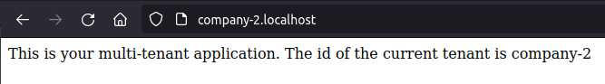

<center>
    <h1>Laravel com multi-tenancy</h1>
</center>

## Framework:

- [**Laravel 10.10**](https://laravel.com/)
- [**TailwindCSS 3.3.5**](https://tailwindcss.com/)

## Package

- [**Stancl / tenancy**](https://tenancyforlaravel.com/)


## Requerimenos minimos

- [**Docker**](https://docs.docker.com/engine/install/)
- [**Git**](https://git-scm.com/)


<hr>

### Projeto

Utilizando o pacote multi-database stancl/tenancy para fazer uma aplicação que tenha banco de dados independentes por 'usuario' acessiveis por subdominio.
<hr>

### Como rodar a aplicação:

#### Cópie o repositório:

```
git clone git@github.com:Elivandro/multi-tenancy.git
cd multi-tenancy
```

renomeie arquivo de variaveis env

```
cp .env.example .env
```

Para instalar as dependências do composer com o docker:

```
docker run --rm -it\
    -u "$(id -u):$(id -g)" \
    -v "$(pwd):/var/www/html" \
    -w /var/www/html \
    laravelsail/php82-composer:latest \
    composer install --ignore-platform-reqs

OR
composer install
```

Inicie o sail
```
./vendor/bin/sail up -d
```

Gere uma chave para aplicação

```
./vendor/bin/sail artisan key:generate
```

Para instalar as dependências do npm:
```
./vendor/bin/sail npm install
```

configure no arquivo .env

```
DB_CONNECTION=pgsql
DB_HOST=pgsql
DB_PORT=5432
DB_DATABASE=multi_tenancy
DB_USERNAME=sail
DB_PASSWORD=password

```

rode as migrações com alguns dados

```
./vendor/bin/sail artisan migrate --seed

```

rodar o vite

```
./vendor/bin/sail npm run dev
```

<div>
    
    
</div>

coloque um apelido ao sail

[Shell alias](
https://laravel.com/docs/10.x/sail#configuring-a-shell-alias)